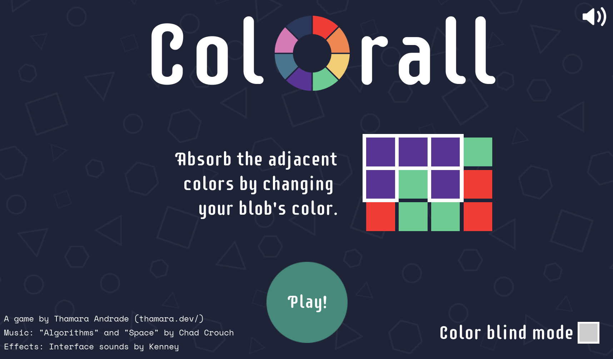
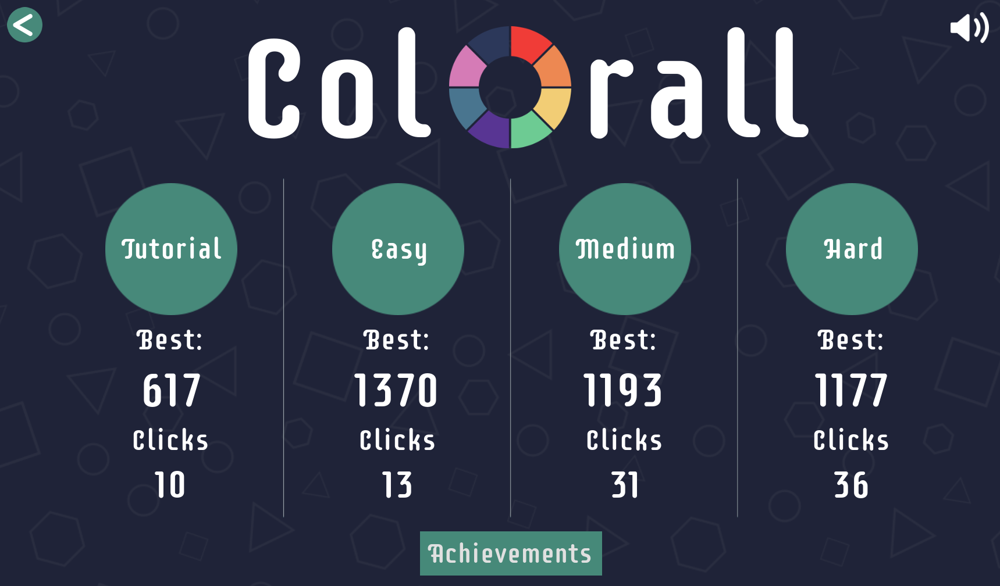
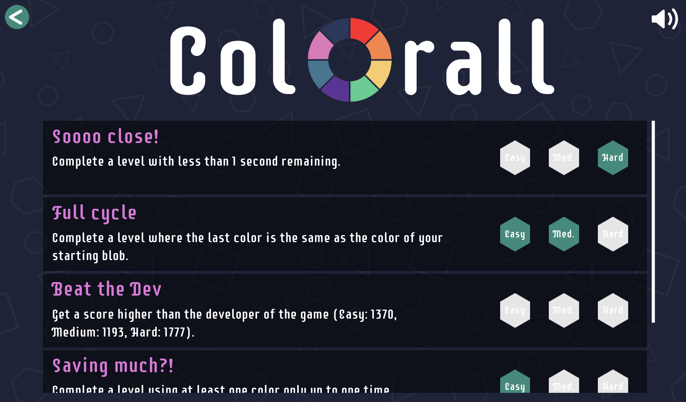
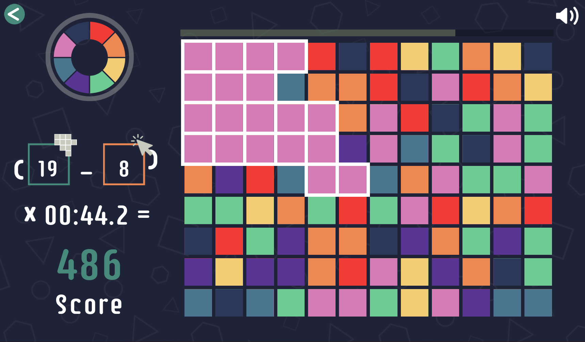
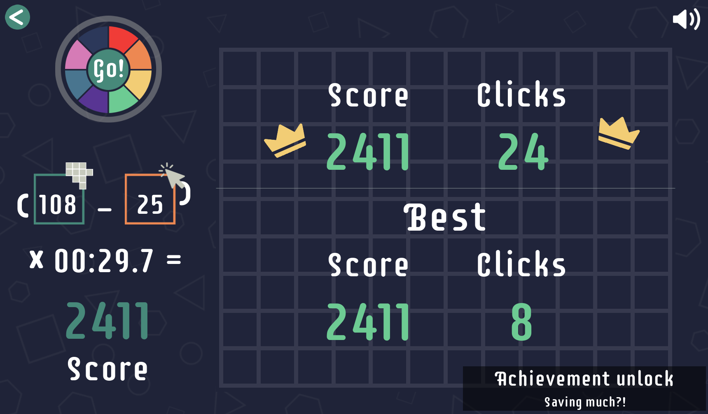
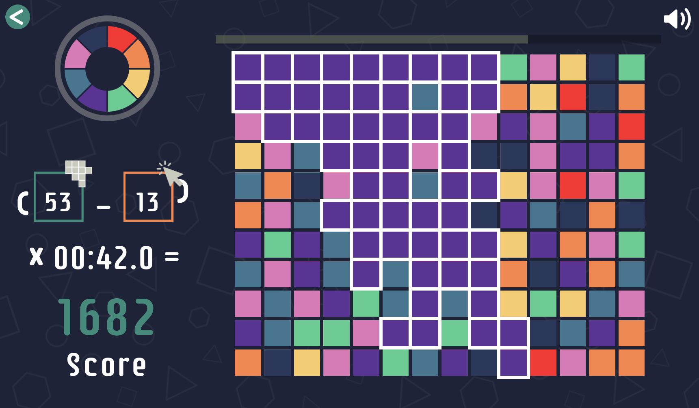

  

Colorall is a game where you need to grow your color blob by changing its color to match the adjacent tiles. When an adjacent tile is the same color as your blob, you absorb it.

Your goal is to completely take over the grid with your blob in any color... but you only have one minute.

# Play now

Challenge yourself and collect all the achievements!

Play with the mouse directly on the browser at [itch.io](https://thamara.itch.io/colorall), or download the executable and run locally.

# Development

Colorall was developed using [Godot Engine](https://godotengine.org/) and GDScript.

# Credits
Colorall was developed with lots of love <3 by [Thamara Andrade](https://twitter.com/thamyk) for the [One Minute Jam #5](https://itch.io/jam/one-minute-game-jam-5).

- Music: "Algorithms" and "Space" by [Chad Crouch](https://freemusicarchive.org/music/Chad_Crouch) (CC BY-NC 4.0)
- Sounds: Interface sounds by [Kenney](https://kenney.nl/assets/interface-sounds) (CC0 1.0 Universal)
- Font: Supermercado One by [James Grieshaber](https://fonts.google.com/specimen/Supermercado+One) (OFL)

# Thanks 💜
Huge thanks to the Bárbara, Daniel, Arthur, Daniel and Hamilton who helped test and improve the game <3

--------
# Screenshots

  
  
  
  
  
  

